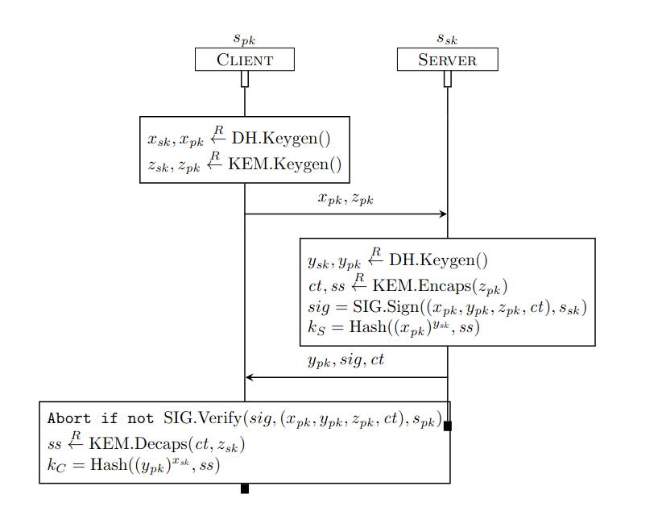

## Protocol: KEM Diffie-Hellman

The server generates a private-public long-term key pair `(s_sk, s_pk)`. The public key is known to the network and all clients.

#### Useful Tamarin built-ins theory for common operators:

* The built-in `hashing` declares the function name `h/1`, i.e., a function named h
of arity 1 for which no equations are given.

* The built-in theory `signing` for signature schemes. It defines the function symbols `sign/2`, `verify/3`, `pk/1`, and `true`, which are related by the equation `verify(sign(m,sk),m,pk(sk)) = true`. 

* The built-in `asymmetric-encryption` that models a public key encryption scheme. It defines the function symbols `aenc/2`, `adec/2`, and `pk/1`, which are related by the equation
`adec(aenc(m, pk(sk)), sk) = m`.

* The built-in `diffie-hellman` provides the function symbols and equetions for Diffie-Hellman operations.

### Protocol Model

Using the skeleton file `KemDH.spthy` and the hints below, model this protocol. 

* Write a rule that allows a server to generate their long-term private/public key pair. 

* Model the rest of the protocol. 

* Write an executability lemma to verify that your model is actually executable: add action facts accordingly and make sure that Tamarin returns the expected protocol run (the graph in interactive mode). 

### Security Properties: TODO
