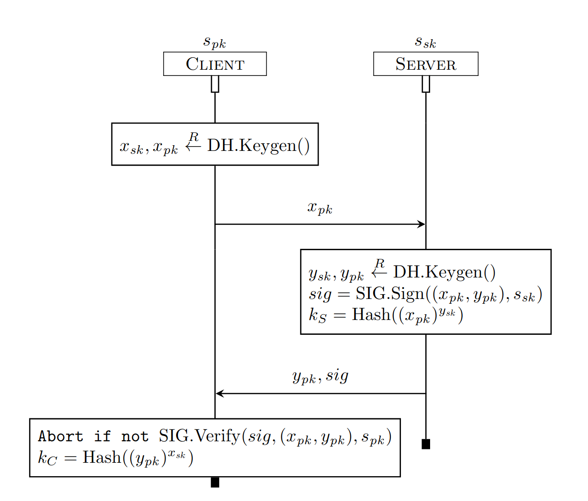

## Exercise 1: Signed Diffie-Hellman

The server generates a private-public long-term key pair `(s_sk, s_pk)`. The public key is known to the network and all clients.

- To bootstrap the protocol, the client generates a public-private Diffie-Hellman key. Stores the private key and sends the public one to the server.
- The server generates their own public-private keypair, signs the two public shares with the private long-term key, and calculates the session key `k_S`.
- Client verifies the signature, and calculates their session key `k_C`.

#### Useful Tamarin built-ins theory for common operators:

* The built-in `hashing` declares the function name `h/1`, i.e., a function named h
of arity 1 for which no equations are given.

* The built-in theory `signing` for signature schemes. It defines the function symbols `sign/2`, `verify/3`, `pk/1`, and `true`, which are related by the equation `verify(sign(m,sk),m,pk(sk)) = true`. 

* The built-in `asymmetric-encryption` that models a public key encryption scheme. It defines the function symbols `aenc/2`, `adec/2`, and `pk/1`, which are related by the equation
`adec(aenc(m, pk(sk)), sk) = m`.

* The built-in `diffie-hellman` provides the function symbols and equetions for Diffie-Hellman operations.

### Protocol Model

Using the skeleton file `SignedDH.spthy` and the hints below, model this protocol. 

* Write a rule that allows a server to generate their long-term private/public key pair. 

* Model the rest of the protocol. 

* Write an executability lemma to verify that your model is actually executable: add action facts accordingly and make sure that Tamarin returns the expected protocol run (the graph in interactive mode). 

### Security Properties: Secrecy

This protocol should guarantee that no party other than Client and Server can obtain the session key, *if both parties finish the protocol*.

* Add the following two action facts to the appropriate rules:
  * `SecretServer(k_s)`: Indicates that at this point the server ($S) believes k_s to be secret between her and the client (agent $C).
  * `SecretClient(k_c))`: Indicates that at this point the client (agent $C) believes k_c to be secret between her and the server (agent $S).

* Write lemmas `lemma ServerKeySecrecy` and `lemma ClientKeySecrecy` checking the secrecy of terms _k_s_ and _k_c_ (you may of course re-use the ones from the previous exercise). 

Verify both lemmas. The results should be different! While Tamarin should verify `ClientKeySecrecy`, it should falsify `ServerKeySecrecy`. 

Try to understand the attack graph Tamarin produces.

### Security Properties: Server Authentication

This protocol should guarantee that once the client reaches the end of the protocol, there exists a sever instance that has executed the 
protocol with the same parameters.

* Add the following two action facts to the approriate server and client rules:

  * `ServerAccepts($S, x_pk, y_pk, s_pk, sig, k_s)`: Indicates that at this point the server ($S) has accepted a session established with paramters `x_pk, y_pk` and session key `k_s`.
  * `ClientAccepts($S, x_pk, y_pk, s_pk, sig, k_c)`: Indicates that at this point the client ($S) has accepted a session established with paramters `x_pk, y_pk` and session key `k_s`.

* Write `lemma ServerAuthentication` checking that if the client accepts it implies that a server has accepted before. Verify the lemma.  